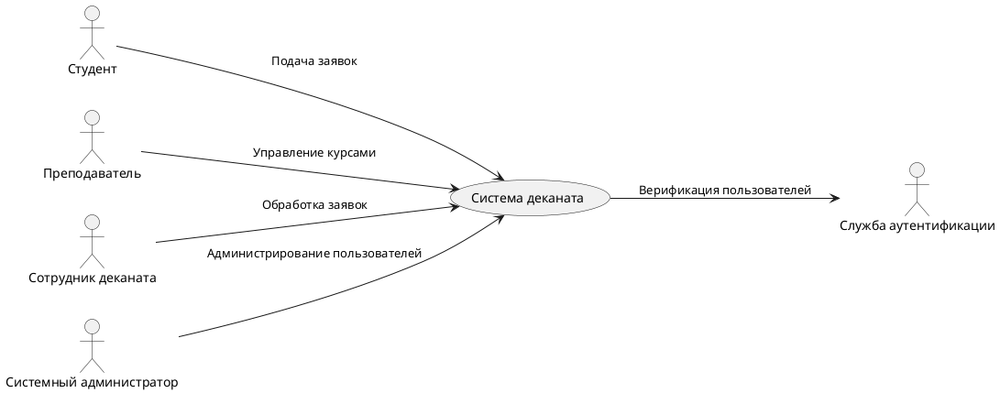

# Видение

## Даты внесения изменений
| Версия | Дата | Описание | Автор |
| --- | --- | --- | --- |
| Черновой начальный вариант | 31 октября, 2024 | Первый черновой вариант. Будет уточнен на стадии развития | Автор |

## Введение
Система деканата представляет собой информационную систему для автоматизации академических процессов в учебных заведениях. Она предназначена для управления курсами, обработки заявок на академический отпуск, перевод в другую группу и других административных процессов, связанных с деятельностью студентов и преподавателей.

## Позиционирование

### Экономические предпосылки
Существующие системы управления учебными процессами зачастую не удовлетворяют потребности учебных заведений в гибкости и адаптации под их уникальные требования. Они не обеспечивают удобного механизма управления заявками студентов, требуют значительных усилий для поддержки и плохо интегрируются с системами аутентификации и безопасности. Наша система деканата предлагает решение этих проблем путем обеспечения гибкости, интеграции с внешними сервисами и масштабируемости для больших учебных заведений.

### Формулировка проблемы
Традиционные системы управления учебными процессами недостаточно поддерживают административные потребности учебных заведений. Это приводит к трудностям в обработке заявок студентов, управлении курсами и организации учебного процесса. Эти проблемы особенно касаются студентов, преподавателей, сотрудников деканата и системных администраторов.

### Место системы
Система деканата предназначена для учебных заведений (вузов, колледжей и т.д.), где необходимо централизованное управление учебными процессами. Она обеспечивает функции, которые отсутствуют в существующих системах, включая гибкое управление заявками и интеграцию с внешними сервисами аутентификации и безопасности.

## Заинтересованные лица

### Пользователи системы
- **Студенты**: Подают заявки на курсы, академический отпуск и перевод в другую группу, отслеживают статус заявок и регистрируются на курсы.
- **Преподаватели**: Создают и управляют курсами, доступными для регистрации студентов.
- **Сотрудники деканата**: Обрабатывают заявки студентов на академический отпуск и перевод, управляют административными процессами.
- **Системные администраторы**: Обеспечивают безопасность системы, управляют учетными записями пользователей и контролируют доступ.

### Цели высокого уровня
| Цель высокого уровня | Приоритет | Проблемы и замечания | Текущие решения |
| --- | --- | --- | --- |
| Автоматизация подачи и обработки заявок студентов | Высокий | Ручная обработка заявок занимает много времени и склонна к ошибкам | Используются внешние системы или бумажные процессы |
| Удобное управление курсами и регистрацией | Высокий | Трудности с регистрацией на курсы, отсутствует интеграция с учебной программой | Частично автоматизированные процессы |
| Обеспечение безопасности данных студентов и преподавателей | Средний | Необходимо защищать личные данные и ограничивать доступ только для авторизованных пользователей | Ограниченная аутентификация и безопасность |

## Обзор

### Перспективы продукта
Система деканата будет использоваться в учебных заведениях и предоставлять централизованный доступ к заявкам студентов и управлению курсами. Она будет интегрирована с системами аутентификации и предоставлять гибкие возможности для адаптации под нужды конкретного учебного заведения.

### Преимущества системы
| Свойство | Преимущества заинтересованных лиц |
| --- | --- |
| Централизованное управление заявками | Упрощает работу деканата, снижает вероятность ошибок |
| Интеграция с системой аутентификации | Обеспечивает безопасность данных и контроль доступа |
| Поддержка адаптации под учебные процессы | Позволяет учебному заведению использовать систему под свои уникальные требования |
| Удобный интерфейс для студентов и преподавателей | Упрощает взаимодействие пользователей с системой |

## Основные свойства системы
- Подача и обработка заявок на академический отпуск и перевод между группами.
- Создание и управление курсами преподавателями.
- Регистрация студентов на курсы.
- Администрирование пользователей и управление безопасностью.
- Интеграция с системой аутентификации для обеспечения безопасности данных.

## Другие требования и ограничения
- Ограниченный доступ к системе только для зарегистрированных пользователей.
- Масштабируемость системы для поддержки больших учебных заведений.
- Система должна обеспечивать стабильную работу и обработку большого объема заявок.
