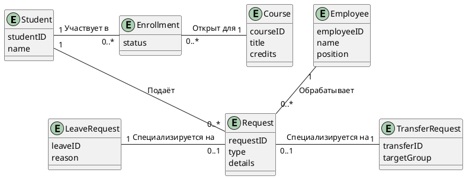

```plantuml
@startuml

entity Student
{
    studentID
    name
}

entity Course
{
    courseID
    title
    credits
}

entity Enrollment
{
    status
}

entity Request
{
    requestID
    type
    details
}

entity Employee
{
    employeeID
    name
    position
}

entity LeaveRequest
{
    leaveID
    reason
}

entity TransferRequest
{
    transferID
    targetGroup
}

Student "1" -right-- "0..*" Enrollment : Участвует в
Course "1" -left-- "0..*" Enrollment : Открыт для

Student "1" -down- "0..*" Request : Подаёт
Employee "1" -down- "0..*" Request : Обрабатывает

Request "0..1" -left- "1" LeaveRequest : Специализируется на
Request "0..1" -right- "1" TransferRequest : Специализируется на

@enduml
```
