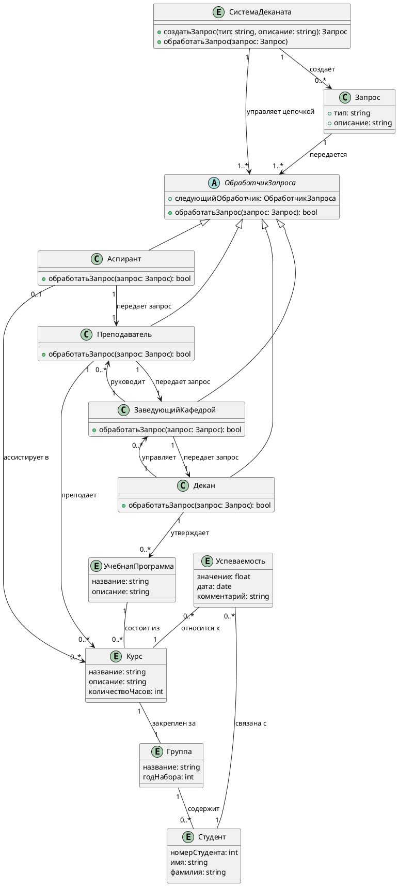

```plantuml
@startuml
entity СистемаДеканата {
    + создатьЗапрос(тип: string, описание: string): Запрос
    + обработатьЗапрос(запрос: Запрос)
}

abstract class ОбработчикЗапроса {
    + следующийОбработчик: ОбработчикЗапроса
    + обработатьЗапрос(запрос: Запрос): bool
}

class Запрос {
    + тип: string
    + описание: string
}

class Аспирант {
    + обработатьЗапрос(запрос: Запрос): bool
}

class Преподаватель {
    + обработатьЗапрос(запрос: Запрос): bool
}

class ЗаведующийКафедрой {
    + обработатьЗапрос(запрос: Запрос): bool
}

class Декан {
    + обработатьЗапрос(запрос: Запрос): bool
}

entity УчебнаяПрограмма {
    название: string
    описание: string
}

entity Курс {
    название: string
    описание: string
    количествоЧасов: int
}

entity Группа {
    название: string
    годНабора: int
}

entity Студент {
    номерСтудента: int
    имя: string
    фамилия: string
}

entity Успеваемость {
    значение: float
    дата: date
    комментарий: string
}

ОбработчикЗапроса <|-- Аспирант
ОбработчикЗапроса <|-- Преподаватель
ОбработчикЗапроса <|-- ЗаведующийКафедрой
ОбработчикЗапроса <|-- Декан

СистемаДеканата "1" --> "1..*" ОбработчикЗапроса : управляет цепочкой
СистемаДеканата "1" --> "0..*" Запрос : создает

Запрос "1" --> "1..*" ОбработчикЗапроса : передается

Аспирант "1" --> "1" Преподаватель : передает запрос
Преподаватель "1" --> "1" ЗаведующийКафедрой : передает запрос
ЗаведующийКафедрой "1" --> "1" Декан : передает запрос

УчебнаяПрограмма "1" -- "0..*" Курс : состоит из
Курс "1" -- "1" Группа : закреплен за
Группа "1" -- "0..*" Студент : содержит
Успеваемость "0..*" -- "1" Студент : связана с
Успеваемость "0..*" -- "1" Курс : относится к

Аспирант "0..1" --> "0..*" Курс : ассистирует в
Преподаватель "1" --> "0..*" Курс : преподает
ЗаведующийКафедрой "1" --> "0..*" Преподаватель : руководит
Декан "1" --> "0..*" ЗаведующийКафедрой : управляет
Декан "1" --> "0..*" УчебнаяПрограмма : утверждает
@enduml
```
