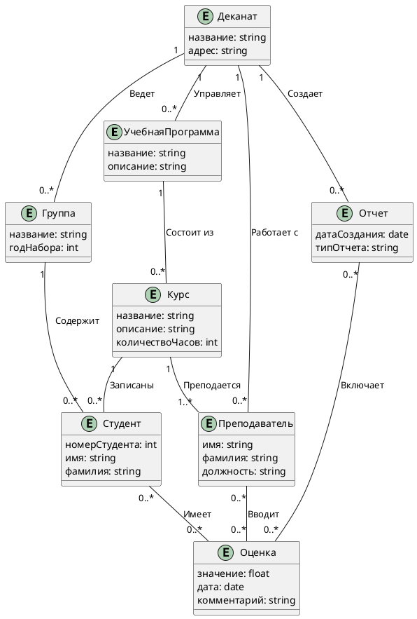

```plantuml
@startuml

entity УчебнаяПрограмма {
    название: string
    описание: string
}

entity Курс {
    название: string
    описание: string
    количествоЧасов: int
}

entity Студент {
    номерСтудента: int
    имя: string
    фамилия: string
}

entity Преподаватель {
    имя: string
    фамилия: string
    должность: string
}

entity Оценка {
    значение: float
    дата: date
    комментарий: string
}

entity Отчет {
    датаСоздания: date
    типОтчета: string
}

entity Деканат {
    название: string
    адрес: string
}

entity Группа {
    название: string
    годНабора: int
}

УчебнаяПрограмма "1" -- "0..*" Курс : Состоит из
Курс "1" -- "0..*" Студент : Записаны
Курс "1" -- "1..*" Преподаватель : Преподается

Студент "0..*" -- "0..*" Оценка : Имеет
Преподаватель "0..*" -- "0..*" Оценка : Вводит

Деканат "1" -- "0..*" УчебнаяПрограмма : Управляет
Деканат "1" -- "0..*" Преподаватель : Работает с
Деканат "1" -- "0..*" Группа : Ведет

Группа "1" -- "0..*" Студент : Содержит

Отчет "0..*" -- "0..*" Оценка : Включает
Деканат "1" -- "0..*" Отчет : Создает

@enduml
```
