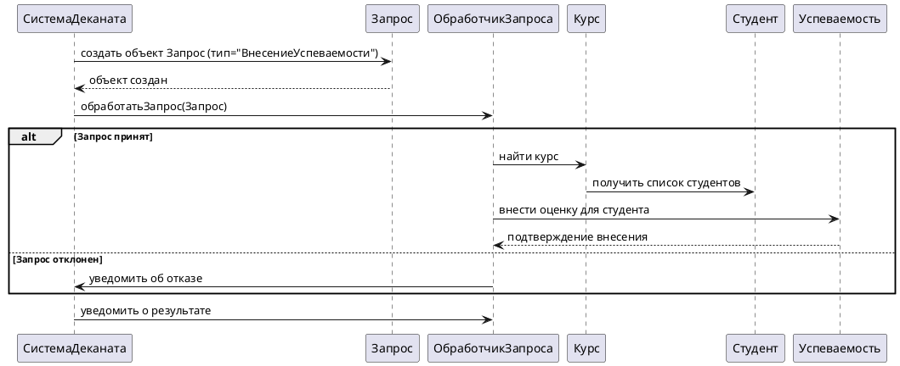

```plantuml
@startuml
participant СистемаДеканата
participant Запрос
participant ОбработчикЗапроса
participant Курс
participant Студент
participant Успеваемость

СистемаДеканата -> Запрос: создать объект Запрос (тип="ВнесениеУспеваемости")
Запрос --> СистемаДеканата: объект создан
СистемаДеканата -> ОбработчикЗапроса: обработатьЗапрос(Запрос)

alt Запрос принят
    ОбработчикЗапроса -> Курс: найти курс
    Курс -> Студент: получить список студентов
    ОбработчикЗапроса -> Успеваемость: внести оценку для студента
    Успеваемость --> ОбработчикЗапроса: подтверждение внесения
else Запрос отклонен
    ОбработчикЗапроса -> СистемаДеканата: уведомить об отказе
end

СистемаДеканата -> ОбработчикЗапроса: уведомить о результате
@enduml

```
