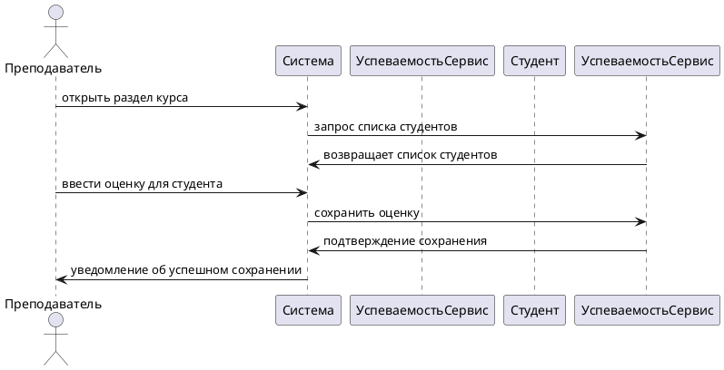

```plantuml
@startuml
actor Преподаватель as Teacher
participant Система as System
participant УспеваемостьСервис as GradeService
participant Студент as Student

Teacher -> System: открыть раздел курса
System -> УспеваемостьСервис: запрос списка студентов
УспеваемостьСервис -> System: возвращает список студентов
Teacher -> System: ввести оценку для студента
System -> УспеваемостьСервис: сохранить оценку
УспеваемостьСервис -> System: подтверждение сохранения
System -> Teacher: уведомление об успешном сохранении
@enduml
```
