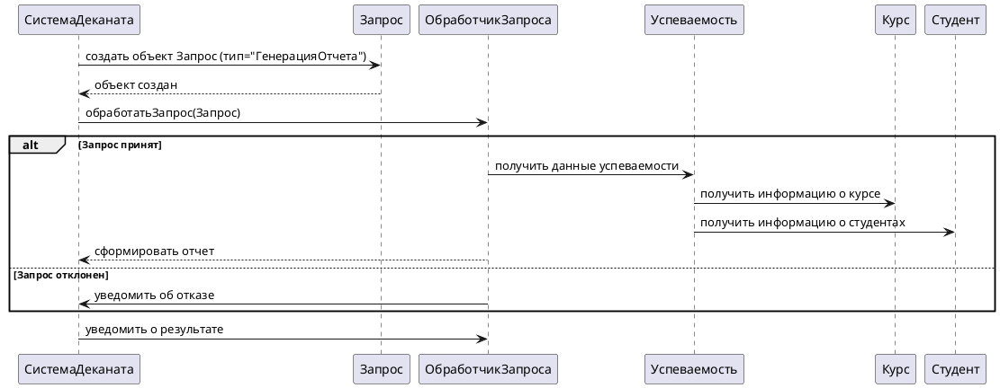

```plantuml
@startuml
participant СистемаДеканата
participant Запрос
participant ОбработчикЗапроса
participant Успеваемость
participant Курс
participant Студент

СистемаДеканата -> Запрос: создать объект Запрос (тип="ГенерацияОтчета")
Запрос --> СистемаДеканата: объект создан
СистемаДеканата -> ОбработчикЗапроса: обработатьЗапрос(Запрос)

alt Запрос принят
    ОбработчикЗапроса -> Успеваемость: получить данные успеваемости
    Успеваемость -> Курс: получить информацию о курсе
    Успеваемость -> Студент: получить информацию о студентах
    ОбработчикЗапроса --> СистемаДеканата: сформировать отчет
else Запрос отклонен
    ОбработчикЗапроса -> СистемаДеканата: уведомить об отказе
end

СистемаДеканата -> ОбработчикЗапроса: уведомить о результате
@enduml

```
