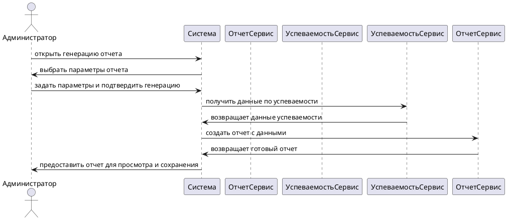

```plantuml
@startuml
actor Администратор as Admin
participant Система as System
participant ОтчетСервис as ReportService
participant УспеваемостьСервис as GradeService

Admin -> System: открыть генерацию отчета
System -> Admin: выбрать параметры отчета
Admin -> System: задать параметры и подтвердить генерацию

System -> УспеваемостьСервис: получить данные по успеваемости
УспеваемостьСервис -> System: возвращает данные успеваемости
System -> ОтчетСервис: создать отчет с данными
ОтчетСервис -> System: возвращает готовый отчет

System -> Admin: предоставить отчет для просмотра и сохранения
@enduml
```
