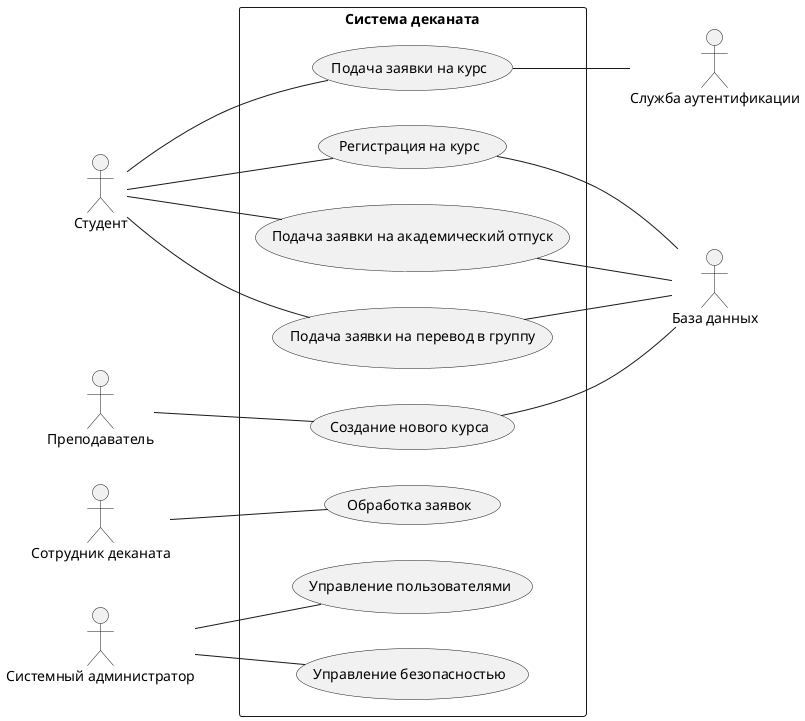

```plantuml
@startuml
skinparam packageStyle rect
left to right direction

:Студент:
:Преподаватель:
:Сотрудник деканата:
:Системный администратор:

package "Система деканата" {

(Подача заявки на курс)
(Создание нового курса)
(Регистрация на курс)
(Подача заявки на академический отпуск)
(Подача заявки на перевод в группу)
(Управление безопасностью)
(Управление пользователями)
(Обработка заявок)

}

:Студент: -- (Подача заявки на курс)
:Студент: -- (Регистрация на курс)
:Студент: -- (Подача заявки на академический отпуск)
:Студент: -- (Подача заявки на перевод в группу)

:Преподаватель: -- (Создание нового курса)

:Сотрудник деканата: -- (Обработка заявок)

:Системный администратор: -- (Управление безопасностью)
:Системный администратор: -- (Управление пользователями)

:Служба аутентификации:
:База данных:

(Подача заявки на курс) -- :Служба аутентификации:
(Регистрация на курс) -- :База данных:
(Подача заявки на академический отпуск) -- :База данных:
(Подача заявки на перевод в группу) -- :База данных:
(Создание нового курса) -- :База данных:

@enduml
```
