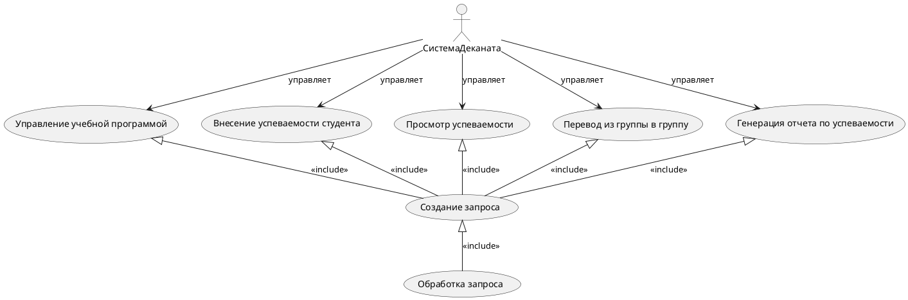

```plantuml
@startuml
actor СистемаДеканата as SystemDean

usecase "Управление учебной программой" as UC1
usecase "Внесение успеваемости студента" as UC2
usecase "Просмотр успеваемости" as UC3
usecase "Перевод из группы в группу" as UC4
usecase "Генерация отчета по успеваемости" as UC5

SystemDean --> UC1 : управляет
SystemDean --> UC2 : управляет
SystemDean --> UC3 : управляет
SystemDean --> UC4 : управляет
SystemDean --> UC5 : управляет

usecase "Создание запроса" as UC_CreateRequest
usecase "Обработка запроса" as UC_ProcessRequest

UC1 <|-- UC_CreateRequest : <<include>>
UC2 <|-- UC_CreateRequest : <<include>>
UC3 <|-- UC_CreateRequest : <<include>>
UC4 <|-- UC_CreateRequest : <<include>>
UC5 <|-- UC_CreateRequest : <<include>>

UC_CreateRequest <|-- UC_ProcessRequest : <<include>>

@enduml

```
