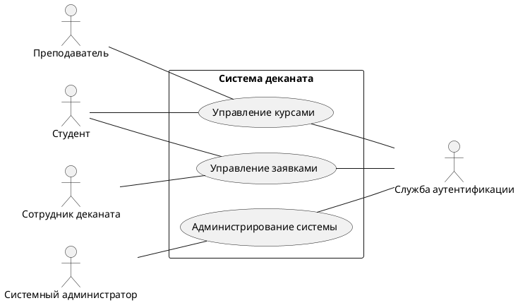

```plantuml
@startuml
skinparam packageStyle rect
left to right direction

:Студент:
:Преподаватель:
:Сотрудник деканата:
:Системный администратор:

package "Система деканата" {

(Управление курсами)
(Управление заявками)
(Администрирование системы)

}

:Студент: -- (Управление курсами)
:Студент: -- (Управление заявками)

:Преподаватель: -- (Управление курсами)

:Сотрудник деканата: -- (Управление заявками)

:Системный администратор: -- (Администрирование системы)

:Служба аутентификации:

(Управление курсами) -- :Служба аутентификации:
(Управление заявками) -- :Служба аутентификации:
(Администрирование системы) -- :Служба аутентификации:

@enduml

```
