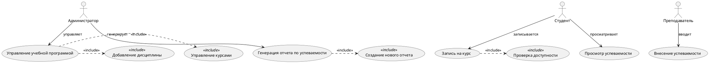

```plantuml
@startuml
actor Администратор as Admin
actor Преподаватель as Teacher
actor Студент as Student

usecase UC1 as "Управление учебной программой"
usecase UC2 as "Внесение успеваемости"
usecase UC3 as "Просмотр успеваемости"
usecase UC4 as "Запись на курс"
usecase UC5 as "Генерация отчета по успеваемости"

Admin --> UC1 : управляет
Admin --> UC5 : генерирует

Teacher --> UC2 : вводит
Student --> UC3 : просматривает
Student --> UC4 : записывается

usecase UC6 as "Управление курсами" <<include>>
usecase UC7 as "Проверка доступности" <<include>>
usecase UC8 as "Создание нового отчета" <<include>>
usecase UC9 as "Добавление дисциплины" <<include>>

UC1 .> UC6 : <<include>>
UC1 .> UC9 : <<include>>
UC5 .> UC8 : <<include>>
UC4 .> UC7 : <<include>>

@enduml
```
