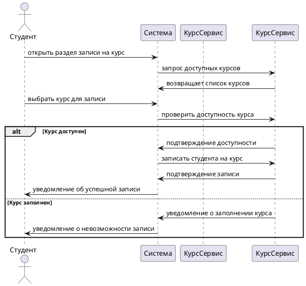

```plantuml
@startuml
actor Студент as Student
participant Система as System
participant КурсСервис as CourseService

Student -> System: открыть раздел записи на курс
System -> КурсСервис: запрос доступных курсов
КурсСервис -> System: возвращает список курсов

Student -> System: выбрать курс для записи
System -> КурсСервис: проверить доступность курса
alt Курс доступен
    КурсСервис -> System: подтверждение доступности
    System -> КурсСервис: записать студента на курс
    КурсСервис -> System: подтверждение записи
    System -> Student: уведомление об успешной записи
else Курс заполнен
    КурсСервис -> System: уведомление о заполнении курса
    System -> Student: уведомление о невозможности записи
end
@enduml
```
