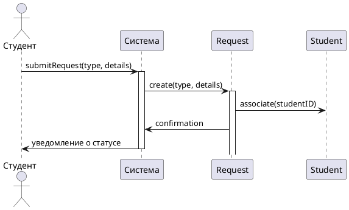

```plantuml
@startuml

actor Студент

Студент -> Система : submitRequest(type, details)
activate Система
Система -> Request : create(type, details)
activate Request
Request -> Student : associate(studentID)

Система <- Request : confirmation
Студент <- Система : уведомление о статусе
deactivate Система

@enduml
```
