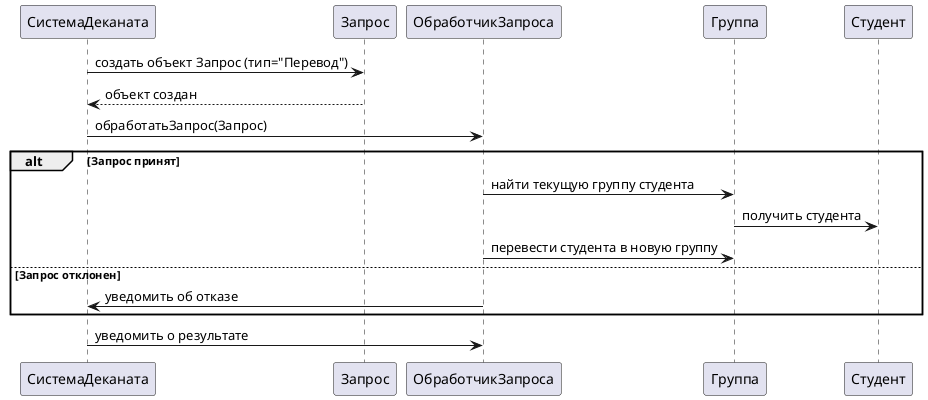

```plantuml
@startuml
participant СистемаДеканата
participant Запрос
participant ОбработчикЗапроса
participant Группа
participant Студент

СистемаДеканата -> Запрос: создать объект Запрос (тип="Перевод")
Запрос --> СистемаДеканата: объект создан
СистемаДеканата -> ОбработчикЗапроса: обработатьЗапрос(Запрос)

alt Запрос принят
    ОбработчикЗапроса -> Группа: найти текущую группу студента
    Группа -> Студент: получить студента
    ОбработчикЗапроса -> Группа: перевести студента в новую группу
else Запрос отклонен
    ОбработчикЗапроса -> СистемаДеканата: уведомить об отказе
end

СистемаДеканата -> ОбработчикЗапроса: уведомить о результате
@enduml
```
