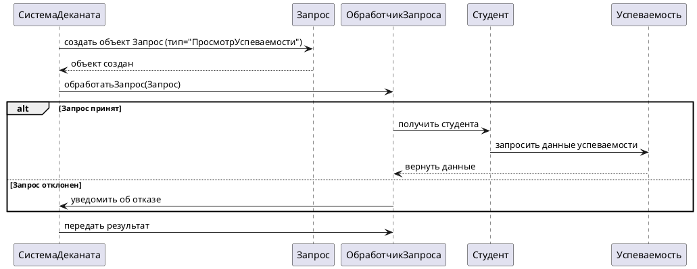

```plantuml
@startuml
participant СистемаДеканата
participant Запрос
participant ОбработчикЗапроса
participant Студент
participant Успеваемость

СистемаДеканата -> Запрос: создать объект Запрос (тип="ПросмотрУспеваемости")
Запрос --> СистемаДеканата: объект создан
СистемаДеканата -> ОбработчикЗапроса: обработатьЗапрос(Запрос)

alt Запрос принят
    ОбработчикЗапроса -> Студент: получить студента
    Студент -> Успеваемость: запросить данные успеваемости
    Успеваемость --> ОбработчикЗапроса: вернуть данные
else Запрос отклонен
    ОбработчикЗапроса -> СистемаДеканата: уведомить об отказе
end

СистемаДеканата -> ОбработчикЗапроса: передать результат
@enduml

```
