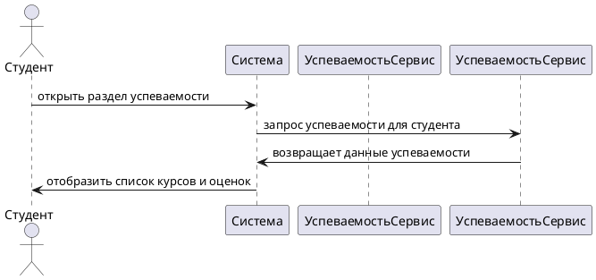

```plantuml
@startuml
actor Студент as Student
participant Система as System
participant УспеваемостьСервис as GradeService

Student -> System: открыть раздел успеваемости
System -> УспеваемостьСервис: запрос успеваемости для студента
УспеваемостьСервис -> System: возвращает данные успеваемости
System -> Student: отобразить список курсов и оценок
@enduml
```
