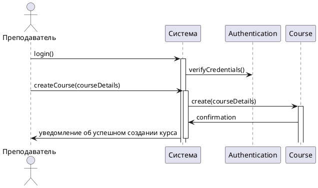

```plantuml
@startuml

actor Преподаватель

Преподаватель -> Система : login()
activate Система
Система -> Authentication : verifyCredentials()
deactivate Authentication

Преподаватель -> Система : createCourse(courseDetails)
activate Система
Система -> Course : create(courseDetails)
activate Course

Система <- Course : confirmation
Преподаватель <- Система : уведомление об успешном создании курса
deactivate Система

@enduml
```
