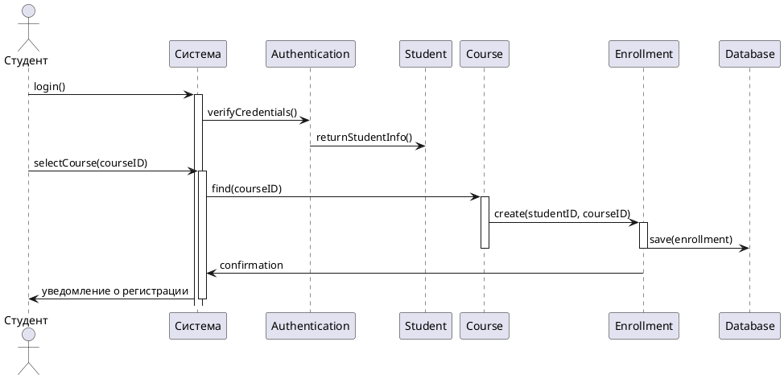

```plantuml
@startuml

actor Студент

Студент -> Система : login()
activate Система
Система -> Authentication : verifyCredentials()
Authentication -> Student : returnStudentInfo()
deactivate Authentication

Студент -> Система : selectCourse(courseID)
activate Система
Система -> Course : find(courseID)
activate Course
Course -> Enrollment : create(studentID, courseID)
activate Enrollment
Enrollment -> Database : save(enrollment)
deactivate Enrollment
deactivate Course

Система <- Enrollment : confirmation
Студент <- Система : уведомление о регистрации
deactivate Система

@enduml
```
