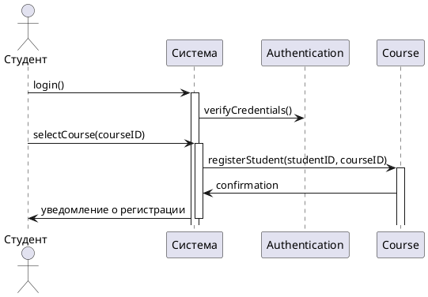

```plantuml
@startuml

actor Студент

Студент -> Система : login()
activate Система
Система -> Authentication : verifyCredentials()
deactivate Authentication

Студент -> Система : selectCourse(courseID)
activate Система
Система -> Course : registerStudent(studentID, courseID)
activate Course

Система <- Course : confirmation
Студент <- Система : уведомление о регистрации
deactivate Система

@enduml
```
