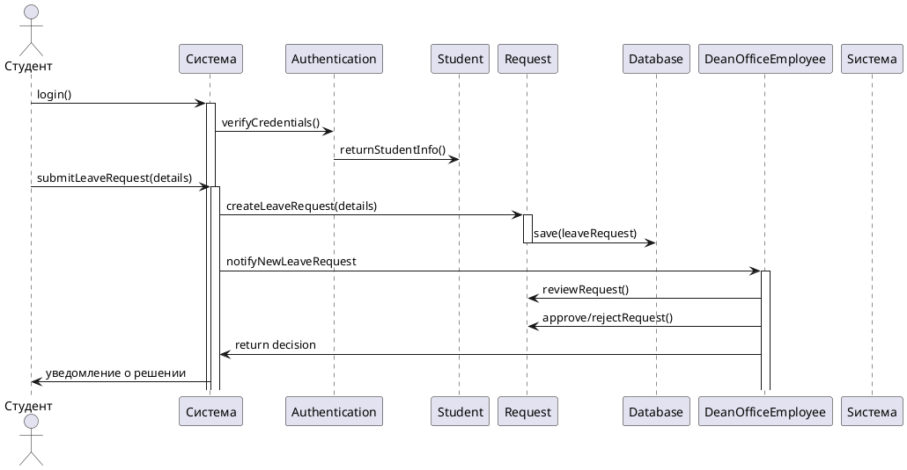

```plantuml
@startuml

actor Студент

Студент -> Система : login()
activate Система
Система -> Authentication : verifyCredentials()
Authentication -> Student : returnStudentInfo()
deactivate Authentication

Студент -> Система : submitLeaveRequest(details)
activate Система
Система -> Request : createLeaveRequest(details)
activate Request
Request -> Database : save(leaveRequest)
deactivate Request

Система -> DeanOfficeEmployee : notifyNewLeaveRequest
activate DeanOfficeEmployee
DeanOfficeEmployee -> Request : reviewRequest()
DeanOfficeEmployee -> Request : approve/rejectRequest()
deactivate Request

Система <- DeanOfficeEmployee : return decision
Студент <- Система : уведомление о решении
deactivate Sистема

@enduml
```
