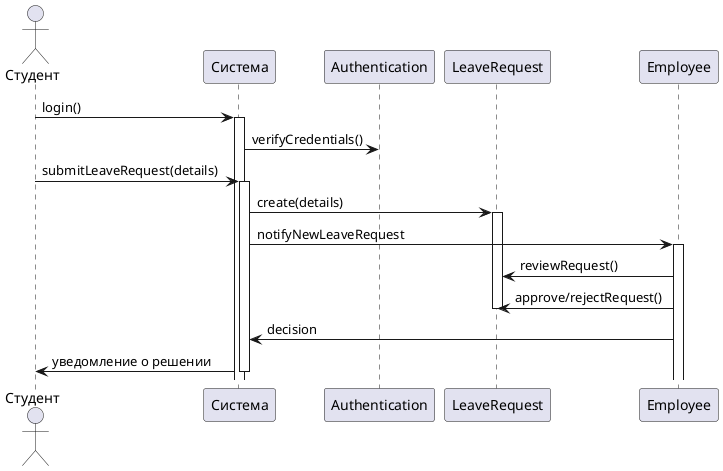

```plantuml
@startuml

actor Студент

Студент -> Система : login()
activate Система
Система -> Authentication : verifyCredentials()
deactivate Authentication

Студент -> Система : submitLeaveRequest(details)
activate Система
Система -> LeaveRequest : create(details)
activate LeaveRequest

Система -> Employee : notifyNewLeaveRequest
activate Employee
Employee -> LeaveRequest : reviewRequest()
Employee -> LeaveRequest : approve/rejectRequest()
deactivate LeaveRequest

Система <- Employee : decision
Студент <- Система : уведомление о решении
deactivate Система

@enduml
```
