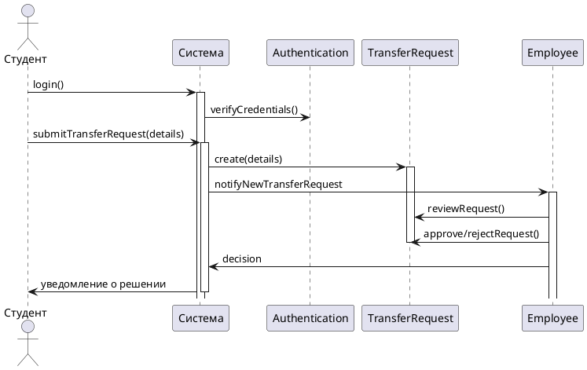

```plantuml
@startuml

actor Студент

Студент -> Система : login()
activate Система
Система -> Authentication : verifyCredentials()
deactivate Authentication

Студент -> Система : submitTransferRequest(details)
activate Система
Система -> TransferRequest : create(details)
activate TransferRequest

Система -> Employee : notifyNewTransferRequest
activate Employee
Employee -> TransferRequest : reviewRequest()
Employee -> TransferRequest : approve/rejectRequest()
deactivate TransferRequest

Система <- Employee : decision
Студент <- Система : уведомление о решении
deactivate Система

@enduml
```
