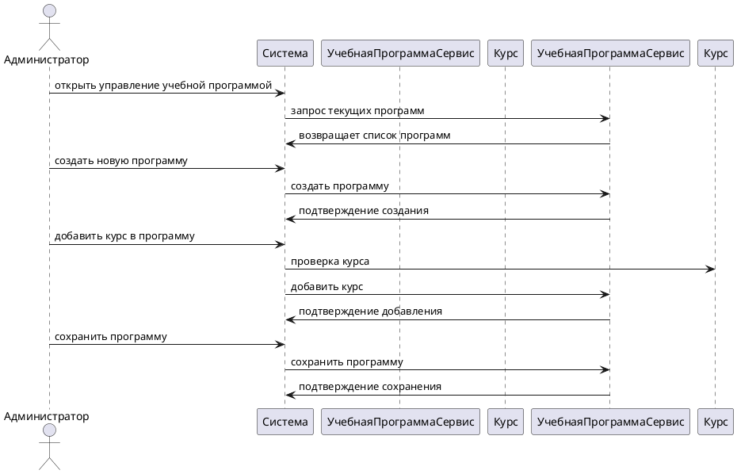

```plantuml
@startuml
actor Администратор as Admin
participant Система as System
participant УчебнаяПрограммаСервис as ProgramService
participant Курс as Course

Admin -> System: открыть управление учебной программой
System -> УчебнаяПрограммаСервис: запрос текущих программ
УчебнаяПрограммаСервис -> System: возвращает список программ

Admin -> System: создать новую программу
System -> УчебнаяПрограммаСервис: создать программу
УчебнаяПрограммаСервис -> System: подтверждение создания

Admin -> System: добавить курс в программу
System -> Курс: проверка курса
System -> УчебнаяПрограммаСервис: добавить курс
УчебнаяПрограммаСервис -> System: подтверждение добавления

Admin -> System: сохранить программу
System -> УчебнаяПрограммаСервис: сохранить программу
УчебнаяПрограммаСервис -> System: подтверждение сохранения
@enduml
```
