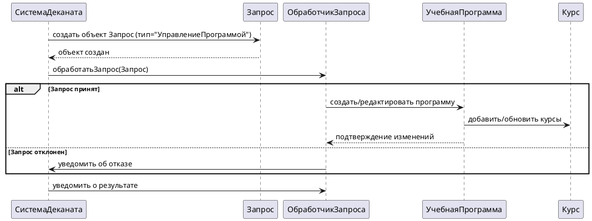

```plantuml
@startuml
participant СистемаДеканата
participant Запрос
participant ОбработчикЗапроса
participant УчебнаяПрограмма
participant Курс

СистемаДеканата -> Запрос: создать объект Запрос (тип="УправлениеПрограммой")
Запрос --> СистемаДеканата: объект создан
СистемаДеканата -> ОбработчикЗапроса: обработатьЗапрос(Запрос)

alt Запрос принят
    ОбработчикЗапроса -> УчебнаяПрограмма: создать/редактировать программу
    УчебнаяПрограмма -> Курс: добавить/обновить курсы
    УчебнаяПрограмма --> ОбработчикЗапроса: подтверждение изменений
else Запрос отклонен
    ОбработчикЗапроса -> СистемаДеканата: уведомить об отказе
end

СистемаДеканата -> ОбработчикЗапроса: уведомить о результате
@enduml

```
